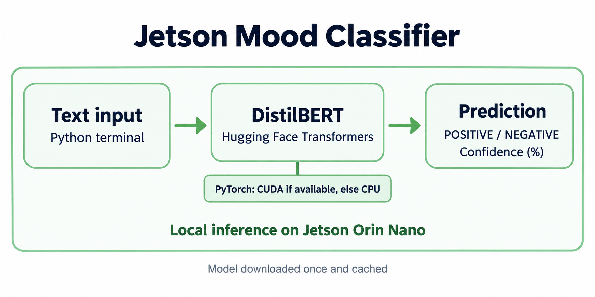

# Jetson Mood Classifier — Version 2

A tiny Python command-line project that labels English text **POSITIVE** or
**NEGATIVE** and prints the model's confidence. Uses Hugging Face Transformers
and the pretrained [DistilBERT sentiment model](https://huggingface.co/distilbert/distilbert-base-uncased-finetuned-sst-2-english).
No training is needed. CUDA is used when PyTorch detects it; otherwise, the app uses CPU.

The model downloads on the first run (internet required). Inference runs locally.
Long inputs are truncated to 512 tokens. Confidence is a model score, not a guarantee.

**New in v2:** microphone input, live English transcription, and spoken predictions.
Sentiment describes the recognized words, not emotion in your tone of voice.

## Architecture

Voice mode: **Microphone → Vosk transcription → DistilBERT → Terminal + eSpeak NG speaker output**.
Vosk and speech output run on CPU; DistilBERT uses CUDA when available.
The original text path is shown below:



## Project structure

```text
jetson-mood-classifier/
├── app.py
├── architecture.png
├── requirements.txt
├── README.md
└── .gitignore
```

## Install and run

```bash
git clone https://github.com/Mrun9/jetson-mood-classifier.git
cd jetson-mood-classifier

python3 -m venv venv
source venv/bin/activate

sudo apt update
sudo apt install libportaudio2 espeak-ng

pip install -r requirements.txt

python3 app.py
```

**Jetson note:** GPU support may require NVIDIA's PyTorch build matched to your
JetPack and Python versions. Follow [NVIDIA's installation guide](https://docs.nvidia.com/deeplearning/frameworks/install-pytorch-jetson-platform/index.html)
to install it inside the activated virtual environment **before** installing the
requirements. A regular PyPI build may not provide Jetson CUDA support.

## Voice mode (Jetson / Ubuntu)

Select your microphone and speaker in Ubuntu's Sound settings, then run:

```bash
source venv/bin/activate
python3 app.py --voice
```

Speak a sentence and pause. Partial words appear as `Hearing:` lines; after a
pause, the final transcript, sentiment, and confidence appear in the terminal.
The speaker reads the sentiment and confidence, then listening resumes.
Wait for `Listening...` before speaking again: the microphone is closed during
prediction and audio output to reduce speaker feedback.

The first voice run downloads [Vosk's small English model](https://alphacephei.com/vosk/models)
(`vosk-model-small-en-us-0.15`, about 40 MB). Both models are cached; subsequent
inference and speech run locally. The app does not save recordings.
Latency and recognition accuracy depend on your hardware, accent, and background noise.

```text
Listening... Speak English, then pause. Say 'exit' or 'quit' to stop.
Hearing: i really enjoyed
Hearing: i really enjoyed this project

You said: i really enjoyed this project

Sentiment: POSITIVE
Confidence: 100.0%
```

The speaker also says: “Positive. Confidence 100.0 percent.” Scores may vary.
Say `exit` or `quit` as a separate utterance, or press Ctrl+C, to stop.

If the wrong microphone is selected:

```bash
python3 app.py --list-devices
python3 app.py --voice --mic 1
```

Replace `1` with an input device number from the list. Speaker output uses the
system default. Test it with `espeak-ng "Speaker test"`.
Typed mode is still available with `python3 app.py`.

## Example output

```text
Jetson Mood Classifier v2

Device: cuda

Enter text: I really enjoyed this project!

Sentiment: POSITIVE
Confidence: 100.0%

Enter text: This was frustrating.

Sentiment: NEGATIVE
Confidence: 99.9%

Enter text: exit
Goodbye!
```

Scores may vary. Type `exit` or `quit`, or press Ctrl+C, to stop.
